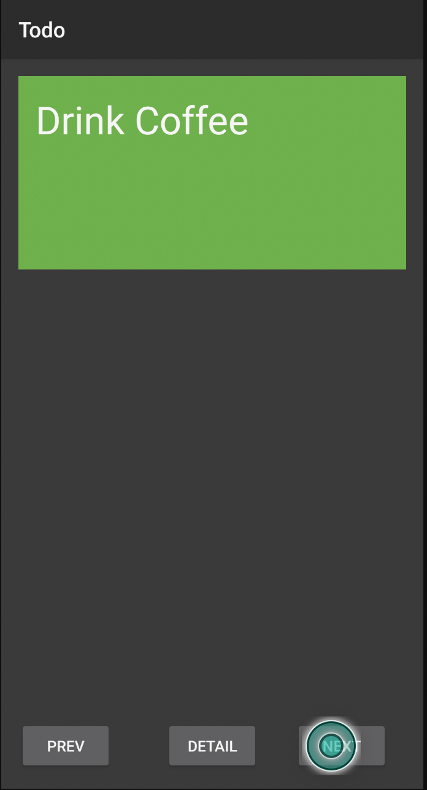
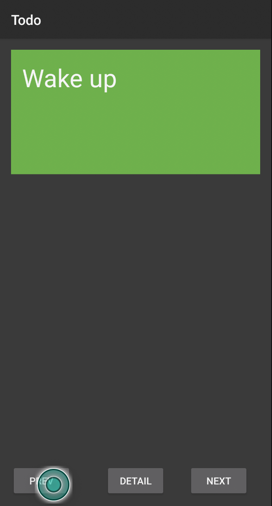
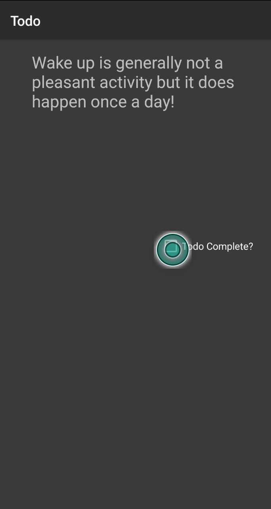
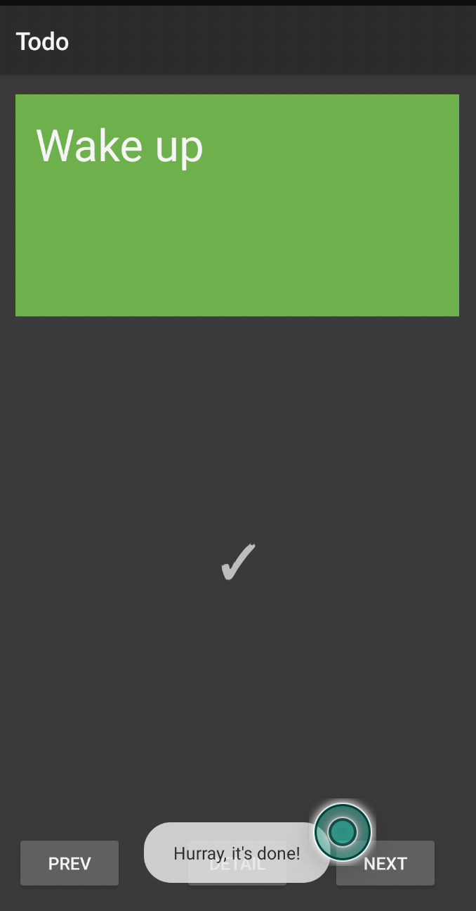

<h2>Todo First App<h2>  
First look of first todo application:

Pressing next button of todo app:

Pressing previous button of todo app:

Pressing detail button of todo app:

Pressing detail button of todo app:

Checking checkbox Todo Complete:

GIF:

